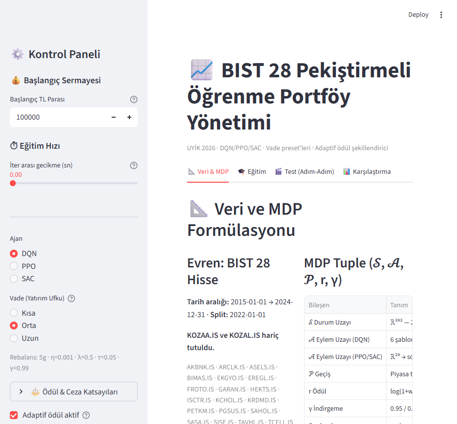
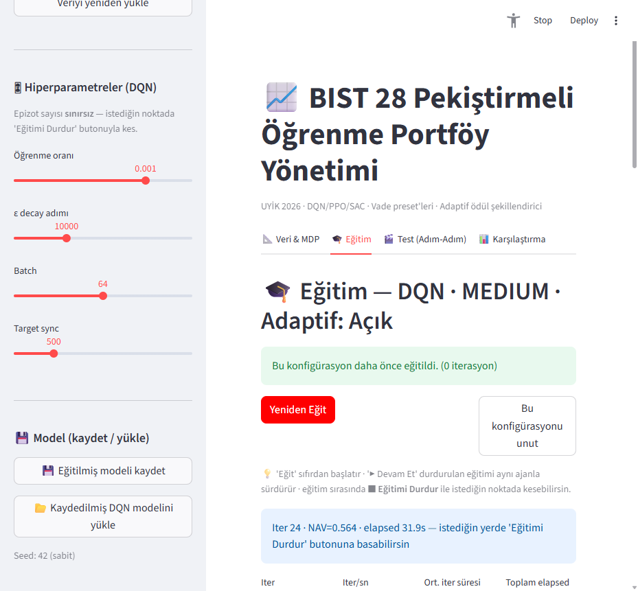
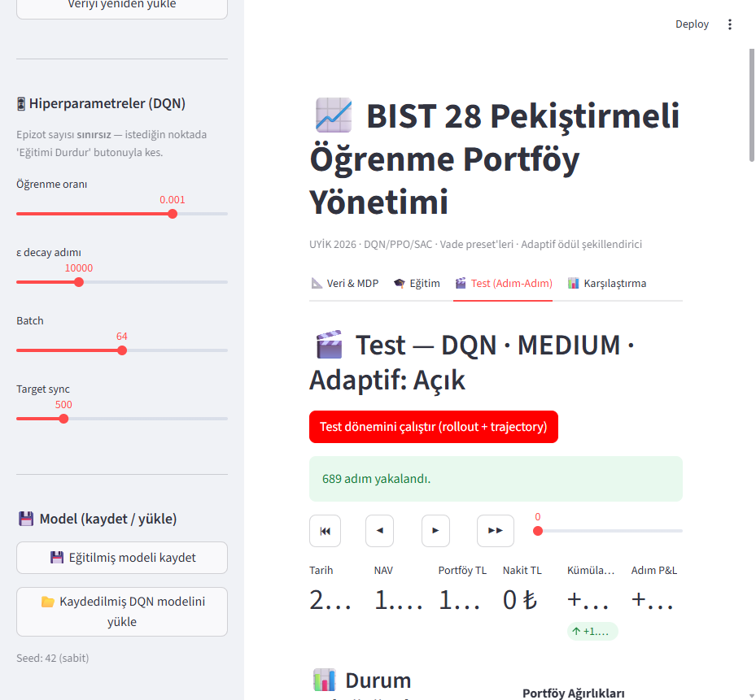
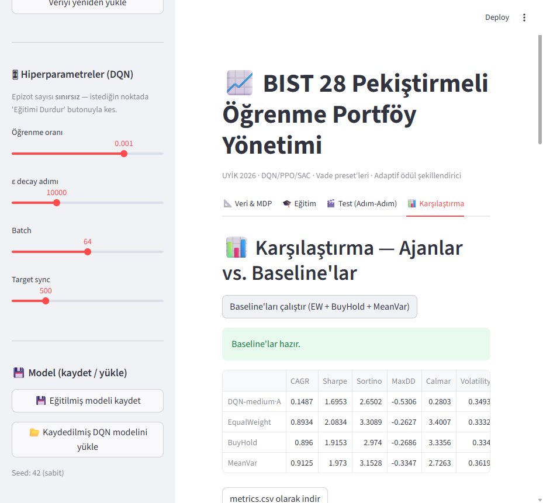

# BIST 28 Portföy Yönetimi — Pekiştirmeli Öğrenme (Final Proje Dokümantasyonu)

> Bu belge, uygulamanın **mimarisini, çalışma mantığını, kullanılan teknolojileri ve
> algoritmaları** tek yerde toplar ve aynı zamanda **PEKİŞTİRMELİ ÖĞRENME Final Projesi**
> şablonunun (PDF) tüm zorunlu başlıklarını (§9.1–§9.9) karşılar. Rapor ve sunum bu
> belgeden türetilebilir.

**Proje adı:** BIST 28 hissesi üzerinde derin pekiştirmeli öğrenme ile portföy yönetimi
**Ajan(lar):** Tek ajan — dört farklı algoritmayla (DQN / PPO / SAC / TD3) bağımsız eğitilir ve karşılaştırılır
**Arayüz:** Streamlit (canlı eğitim + adım-adım test oynatma + karşılaştırma)
**Tohum:** `SEED = 42` (deterministik; golden-master 1e-6 toleransta kilitli)

---

## 0. Hızlı Bakış

| Konu | Değer |
|---|---|
| Problem türü | Sürekli kontrol — portföy tahsisi (continuous control / allocation) |
| Evren | BIST 30'dan 28 hisse (KOZAA.IS, KOZAL.IS hariç) |
| Veri aralığı | 2015-01-01 → 2024-12-31, train/test ayrımı 2022-01-01 |
| Durum uzayı | ℝ³⁹⁷ (DQN/SAC: 13 öznitelik×28 + **4 makro** + 29 ağırlık) · ℝ³⁶⁹ (PPO: 12×28 + 4 makro + 29) |
| Eylem uzayı | Ayrık 6 şablon (DQN) **veya** sürekli ℝ²⁹ → softmax simpleks (PPO/SAC/TD3) |
| Ödül | `log(1+w·r) − η·‖Δw‖₁ − λ·max(0,DD−τ) − iflas + w_dsr·DSR − κ·CVaR` (adaptif + **rejim-amplified**) |
| Makro rejim (V6) | faiz (getiri eğrisi), dolar (USD/TRY), altın (gram-altın/TL) + bileşik rejim skoru |
| Fiyat gürültüsü (V8) | Eğitimde gerçekleşen getiriye slippage (`σ=0.001`) — anti-ezber, hocanın şartı; eval'de kapalı |
| Nakit faizi (V10) | Nakit varlık risksiz faiz kazanır (`cash_annual_rate=0.40`; günlük `(1+r)^(1/252)-1`); ajan fırsat maliyetini içselleştirir |
| Algoritmalar | DQN (ayrık), PPO (sürekli on-policy), SAC (sürekli off-policy stokastik), **TD3 (sürekli off-policy deterministik — hocanın tavsiyesi)** |
| Tahmin katmanı | CNN-LSTM bir-adım getiri tahmincisi (predict-then-optimize, sadece DQN/SAC/TD3) |
| Adil karşılaştırma (V11) | Re-base hizalama + maliyetli baseline + nakit %40 faiz + PPO deterministik eval + 8 metodoloji düzeltmesi |
| Doğrulama | 101 pytest + golden-master regresyon (1e-6) + walk-forward (3 kat) + **titizlik: Deflated/Probabilistic Sharpe + PBO + Monte-Carlo stres** (López de Prado) |
| Teknolojiler | Python 3.10–3.12, PyTorch (CPU), Streamlit, Plotly, matplotlib, pandas, NumPy, yfinance |

> **Ana bulgu (dürüst tez, V11 adil-karşılaştırma):** RL (en iyi TD3 Sharpe 2.151 / SAC 2.141, seed=42), iyi-kurulmuş risk-bazlı optimize edicilerle (InverseVol 2.162, RiskParity 2.135) risk-ayarlıda **başa baş**; naif 1/N eşit-ağırlığı (EW 2.090) ve risksiz faiz hurdle'ı (CashRiskFree NAV 2.506) geçer. MinVariance (Sharpe 2.317) hâlâ önde ama makas kapandı. Mutlak NAV'da RL hafif geride (SAC 5.595 vs BuyHold 5.751). DQN patolojik kararsız (çoklu-seed CV ~%45). V11 adil-karşılaştırma düzeltmeleri (re-base hizalama, maliyetli baseline, nakit faizi) RL'i güçlendirdi: önceki asimetrik ceza (RL maliyet öder/baseline ödemez, RL nakiti %0) kaldırıldı.

---

## 1. Giriş (Rapor §9.1)

> **Ana bulgu (dürüst tez, V11 adil-karşılaştırma):** RL (en iyi TD3 Sharpe 2.151 / SAC 2.141, seed=42), iyi-kurulmuş risk-bazlı optimize edicilerle (InverseVol 2.162, RiskParity 2.135) risk-ayarlıda **başa baş**; naif 1/N eşit-ağırlığı (EW 2.090) ve risksiz faiz hurdle'ı (CashRiskFree NAV 2.506) geçer. MinVariance (Sharpe 2.317) hâlâ önde ama makas kapandı. Mutlak NAV'da RL hafif geride (SAC 5.595 vs BuyHold 5.751). DQN patolojik kararsız (çoklu-seed CV ~%45). V11 adil-karşılaştırma düzeltmeleri (re-base hizalama, maliyetli baseline, nakit %40 faizi) RL'i güçlendirdi: önceki asimetrik ceza (RL maliyet öder/baseline ödemez, RL nakiti %0) kaldırıldı.

**Problem neden önemli?** Portföy yönetimi, sınırlı sermayeyi zaman içinde değişen riskli
varlıklara dağıtma problemidir. Her gün piyasa yeni bilgi üretir; yatırımcı işlem maliyeti,
düşüş (drawdown) riski ve getiri arasında sürekli bir denge kurmak zorundadır. Bu, doğası
gereği **ardışık karar verme** (sequential decision-making) problemidir.

**RL ile çözülmesi neden anlamlı?** Klasik yöntemler (eşit ağırlık, al-tut, ortalama-varyans)
ya statiktir ya da tek-adımlık optimizasyon yapar; işlem maliyetini, rejim değişimini ve
düşüş cezasını **çok-adımlı** bir amaç içinde birlikte optimize etmez. Pekiştirmeli öğrenme,
ödül fonksiyonuna bu terimleri koyarak ajanın **uzun vadeli iskonto edilmiş ödülü** doğrudan
maksimize etmesini sağlar — tam da portföy yönetiminin doğasına uyan formülasyon budur.

**Ajan hangi kararı öğreniyor?** Ajan her rebalans gününde, gözlediği duruma (teknik
göstergeler + bir-adım getiri tahmini + mevcut ağırlıklar) bakarak **yeni portföy ağırlık
vektörünü** seçer. Öğrendiği politika: "hangi piyasa koşulunda, ne kadar işlem yaparak,
hangi varlıklara ne ağırlık vermeliyim ki düşüşten korunup risk-ayarlı getiriyi
büyüteyim?"

**Bu çalışmanın katkısı:** Tek bir makro rejim skorunu hem duruma (V6) hem de ödüle
(V7 CVaR kuyruk amplifikasyonu) bağlayan birleşik bir tasarım sunması ve López de Prado
titizliğiyle (DSR/PBO) RL'in pasif baseline'ı dürüstçe geçemediğini gösteren bir BIST
portföy-RL referansı olmasıdır.

---

## 2. Problem Tanımı (Rapor §9.2 / PDF §2)

| Başlık | Tanım |
|---|---|
| **Problem adı** | BIST 28 portföy tahsisi |
| **Problem senaryosu** | Ajan, 28 BIST hissesinden oluşan bir piyasada her gün durumu gözler, yeni ağırlık vektörü seçer, ertesi günün getirisiyle NAV'ı güncellenir, ödül alır ve yeni duruma geçer |
| **Ajan / ajanlar** | **Tek ajan.** Üç algoritma (DQN/PPO/SAC) aynı problem için ayrı ayrı eğitilip karşılaştırılır |
| **Görev hedefi** | Test döneminde (2022–2024) risk-ayarlı getiriyi (Sharpe/Sortino) ve nihai NAV'ı, klasik baseline'ları geçecek şekilde büyütmek |
| **Başlangıç koşulları** | Episode başında portföy %100 nakit (`w = [0,…,0,1]`), NAV=1.0. Eğitimde rastgele başlangıç penceresi (`random_start`), değerlendirmede sabit başlangıç |
| **Değişkenlik** | Eğitimde her episode farklı tarih penceresinden başlar (çeşitlilik → genelleme). Piyasa getirileri stokastiktir; vade preset'i (kısa/orta/uzun) rebalans frekansını ve ödül katsayılarını değiştirir |
| **Başarı ölçütü** | Episode sonunda ajan NAV'ı eşit-ağırlık benchmark NAV'ını geçtiyse "başarılı" (`success_vs_benchmark`); test döneminde Sharpe/Sortino/CAGR baseline üstü |
| **Başarısızlık durumu** | NAV iflas eşiğinin (varsayılan 0.01) altına düşerse episode "iflas" ile biter ve büyük ceza uygulanır |

---

## 2b. Veri Metodolojisi ve Sınırlılıklar

Bu bölüm, deneysel sonuçların yorumlanması için kritik olan veri tasarımı kararlarını ve açık sınırlılıkları belgeler.

### Evren seçimi ve survivorship bias

Evren, bugünkü BIST 30 bileşenlerinden KOZAA.IS ve KOZAL.IS çıkarılarak oluşturulmuştur (28 hisse). Bu seçim yönteminde **survivorship bias** riski mevcuttur: 2015–2024 döneminde BIST 30 endeksinden çıkan, askıya alınan veya delist olan hisseler evrene dahil edilmemiştir. Gerçek bir portföy yöneticisi bu hisselere de maruz kalırdı; bunların dışarıda bırakılması tarihsel performans tahminini iyimser yönde çarpıtabilir. Bu, açık ve dürüst bir metodolojik sınırlılıktır.

KOZAA.IS ve KOZAL.IS'in hariç tutulma gerekçesi: `data.py` satır 17'deki yorum `"KOZAA.IS ve KOZAL.IS prompt gereği hariç tutuldu (28 hisse)"` olarak belgelenmiştir — bu iki ticker proje şartı (sınav ödevi tanımı) gereği kapsam dışıdır.

### Fiyat verisi ve düzeltmeler

- **Kaynak:** yfinance kütüphanesi (`data.py:87–90`), `auto_adjust=True` parametresiyle indirilir. Bu parametre temettü ve hisse bölünmesi (stock split) etkisini geriye dönük olarak ayarlı kapanış fiyatlarına yansıtır; ham fiyat yerine **düzeltilmiş kapanış** kullanılır.
- **Cache:** İlk başarılı indirmede `data/prices.parquet` olarak kaydedilir (pyarrow). Sonraki çalıştırmalar cache'ten okur; `use_cache=False` ile zorla yeniden indirilir.
- **Sentetik GBM fallback:** yfinance erişilemez olduğunda (`data.py:113–121`) BIST istatistiklerine kalibre edilmiş çok değişkenli GBM (Geometric Brownian Motion) üretilir. Sentetik veri cache'e **yazılmaz** (cache zehirlenmesi önlemi, `data.py:125–130`). Sentetik veriden elde edilen sonuçlar yalnızca demo amaçlıdır; gerçek BIST fiyatı değildir.

### Eksik veri işleme

- **Sütun düşürme:** `dropna(thresh=int(0.9 * len(px)))` — bir hissenin toplam veri noktalarının %90'ından fazlası eksikse o hisse düşürülür (`data.py:95`).
- **Doldurma:** `ffill().bfill()` — kalan eksik değerler önce ileri, sonra geri doldurulur.
- **Kısmi indirme koruması:** yfinance bazı ticker'ları getirememişse (`data.py:104–111`) eksik hisseler sentetik GBM ile tamamlanır; böylece evren boyutu (N=28) ve state vektörü boyutu (397) sabit kalır. Bu durum `RuntimeWarning` ile kullanıcıya bildirilir.

### İşlem yapılabilirlik basitleştirmeleri (açık sınırlılıklar)

Modelde aşağıdaki gerçek piyasa etkileri **modellenmemiştir**:

| Basitleştirme | Gerçek piyasadaki karşılığı | Etkisi |
|---|---|---|
| Bid-ask spread | Alış/satış fiyatı farkı | Gerçek işlem maliyeti η·‖Δw‖₁'den yüksek olabilir |
| Likidite kısıtı | Büyük emirlerin fiyatı hareket ettirmesi (market impact) | Küçük portföylerde ihmal edilebilir, büyük fonlarda kritik |
| Fiyat limitleri (devre kesici) | BIST günlük %10 tavan/taban | Kriz günlerinde gerçekleştirilemez emirler |
| BSMV / damga vergisi | İşlem başına %0.2 BSMV | Yüksek turnover'da ek maliyet |
| Lot kısıtı | Minimum işlem birimi (lot=1 hisse) | Küçük portföylerde tahsis hassasiyeti kaybolur |
| Slippage (V8) | Eğitimde Gauss gürültüsü σ=0.001 eklendi (`EnvConfig.price_noise_std`) | Kısmi: anti-ezber amaçlı, gerçek likidite modeli değil |

Test dönemi yalnızca 2022–2024 (≈3 yıl, tek kesim) kullanılmıştır. Farklı piyasa rejimleri (2008, 2013 BIST çöküşü, pandemi) test setine dahil değildir; walk-forward (3 kat) bu sınırlamayı kısmen giderir ancak tam olarak çözmez.

---

## 3. Problem Kısıtları (PDF §3)

| Kısıt türü | Bu projedeki karşılığı |
|---|---|
| **Simpleks kısıtı** | Ağırlıklar softmax'tan geçer → `wᵢ ≥ 0`, `Σwᵢ = 1` (kısa satış yok, kaldıraç yok) |
| **İşlem (turnover) kısıtı** | Her rebalansta `‖Δw‖₁` kadar işlem maliyeti ödülden düşülür ve NAV'ı azaltır (η katsayısı) |
| **Rebalans frekansı kısıtı** | Ağırlık yalnızca rebalans günlerinde değişir (kısa=1, orta=5, uzun=20 günde bir); ara günlerde önceki ağırlık korunur |
| **Düşüş (drawdown) kısıtı** | Tepe-değerden düşüş τ eşiğini aşınca λ ile cezalandırılır (risk yönetimi) |
| **Güvenlik / iflas kısıtı** | NAV < `bankruptcy_nav` → episode biter, ek ceza (`bankruptcy_penalty`) |
| **Zaman kısıtı** | Eğitim episode'u en fazla `train_max_steps` (vadeye göre: Kısa 30, Orta 90, Uzun 360 gün) sürer; eval tam test dönemi boyunca çalışır. UI'dan vade aralığı içinde (min_days–max_days) slider ile seçilebilir |
| **Ayrık eylem kısıtı (DQN)** | DQN yalnızca 6 önceden tanımlı şablondan birini seçebilir; aralık-dışı indeks `ValueError` ile reddedilir |
| **Sızıntısızlık kısıtı** | Tüm öznitelikler yalnız geçmişe bakar; ölçekleyici (z-score) ve tahminci yalnız train'de fit edilir, test'e uygulanır ama orada fit edilmez |

---

## 4. Amaç Fonksiyonu (Rapor §9.4 / PDF §4)

**Genel RL amacı:**

```
max_π  E_π [ Σ_{t=0}^{T} γ^t · r_t ]
```

**Probleme özel amaç** (ödül terimleri açık yazılırsa):

```
max_π  E_π [ Σ_t γ^t ( log(1 + wₜ·r_{t+1})           ← risk-getiri (log büyüme)
                       − ηₜ·‖Δwₜ‖₁                    ← işlem maliyeti
                       − λₜ·max(0, DDₜ − τₜ)          ← düşüş cezası
                       − C_iflas·𝟙[NAV<NAV_min]       ← iflas cezası
                       + w_dsr·DSRₜ                   ← çevrim-içi risk-ayarı (Diferansiyel Sharpe)
                       − κₜ·CVaRₜ ) ]                 ← rejim-amplified kuyruk-riski cezası (V7)
```

Yani ajan; **log-büyümeyi ve risk-ayarlı getiriyi artırmaya**, **işlem maliyetini, düşüşü ve
iflas riskini azaltmaya** çalışır. η, λ, τ katsayıları sabit değildir — `AdaptiveRewardShaper`
tarafından piyasa rejimine (rolling volatilite & turnover EWMA) göre anlık ölçeklenir.

| Sembol | Anlam |
|---|---|
| `wₜ` | t anındaki portföy ağırlık vektörü (29-boyut: 28 hisse + nakit) |
| `r_{t+1}` | t+1'deki varlık getirileri |
| `Δwₜ` | ağırlık değişimi (turnover ölçüsü) |
| `DDₜ` | tepe-değerden düşüş oranı |
| `ηₜ, λₜ, τₜ` | adaptif işlem / düşüş-ceza / düşüş-eşik katsayıları |
| `DSRₜ` | Diferansiyel Sharpe (Moody & Saffell çevrim-içi Sharpe türevi) |
| `γ` | iskonto faktörü (kısa 0.95 / orta 0.99 / uzun 0.995) |

---

## 5. MDP Formülasyonu (Rapor §9.3 / PDF §5)

### 5.1. Durum Uzayı (𝒮)

Durum vektörü `sₜ`, her hisse için bir öznitelik bloğu ile mevcut portföy ağırlıklarının
birleşimidir:

```
sₜ = [ z-skorlu teknik öznitelikler (F × 28) ‖ makro rejim (4) ‖ mevcut ağırlıklar (29) ]
```

- **F = 13** (DQN/SAC): 12 teknik öznitelik + 1 CNN-LSTM getiri tahmini → `13×28 + 4 makro + 29 = 397`
- **F = 12** (PPO): forecast özelliği hariç (ablation kararı) → `12×28 + 4 makro + 29 = 369`

**12 teknik öznitelik** (`config.FEATURES`, hepsi yalnız geçmişe bakar, ölçek-bağımsız):
`logret, ma5, ma20, vol20, rsi, macd_hist, bb_pctb, bb_bw, roc10, mom60, vol60, ema_dist`

**4 makro rejim özniteliği (V6)** (`config.MacroConfig`, causal, train-only z-score):
`regime` (bileşik omurga: VIX+S&P) · `slope` (**faiz**: TNX−IRX) · `usd_try_mom` (**dolar**) ·
`gold_tl_mom` (**altın**: gram-altın/TL). Ham `regime` ayrıca V7 ödül amplifikasyonunu besler.

| Soru (PDF §5.1) | Cevap |
|---|---|
| Ajan hangi bilgileri gözlüyor? | Teknik göstergeler (momentum/trend/volatilite/RSI/MACD/Bollinger), bir-adım getiri tahmini, mevcut ağırlıklar |
| Markov özelliğini sağlıyor mu? | **Finansal piyasa tam gözlemlenebilir bir Markov ortamı DEĞİLDİR.** Problem, geçmiş teknik göstergeler + portföy ağırlıklarıyla **yaklaşık bir MDP** (partially observable market process approximated as an MDP) olarak kurulmuştur. İşlem maliyeti `‖wₜ−w_{t−1}‖₁`'e bağlı olduğundan **mevcut ağırlığın state'e dahil edilmesi zorunludur**; geçmiş fiyat tarihçesi kayan-pencere göstergelerle özetlenerek Markov yaklaşımı güçlendirilir. Gizli makro/likidite dinamikleri, piyasa mikroyapısı ve sürü davranışı gibi gözlemlenemeyen etkenler state'te temsil edilmemiştir; bu bir açık sınırlılıktır. |
| Eksik bilgi var mı? | Ham fiyat tarihçesi yerine özetlenmiş göstergeler kullanılır; **V6'dan önce makro rejim eksikti** (faiz/dolar/altın) → eklendi. Gizli piyasa durumu (likidite, kurumsal akım, jeopolitik risk) modellenmemiştir. |
| Durum vektörü kaç boyutlu? | 397 (DQN/SAC) / 369 (PPO) — makro blok dahil |
| Görsel girdi var mı? | Hayır — durum sayısal öznitelik vektörüdür |

Tüm öznitelikler `utils.features.TrainScaler` ile **yalnız train istatistikleriyle**
z-skorlanır; aynı ortalama/std test dönemine uygulanır → veri sızıntısı yok.

**Parametrik tarih seçimi (`config.DataConfig`):** Train başlangıcı, train/test ayrım tarihi
ve test bitiş tarihi `config.py`'deki `DataConfig` dataclass'ında tek kaynaktan yönetilir.
`data.py` modül sabitleri (`START`, `END`, `SPLIT`) bu dataclass'a işaret eder; UI'daki
tarih seçiciler bu değerleri `download_bist(start, end)` ve `train_test_split(split)` ile
çalışma-zamanında enjekte eder. Varsayılan: `start="2015-01-01"`, `end="2024-12-31"`,
`train_end="2022-01-01"`. Sızıntı-güvenlidir: scaler ve forecaster yalnız `train < split`
verisinde fit edilir.

### 5.2. Eylem Uzayı (𝒜)

- **Ayrık (DQN):** 6 portföy şablonu — `{Nakit, Eşit Ağırlık, Top-3 Momentum, Top-5 Momentum,
  Ters Volatilite, Min Volatilite}`. Ajan şablon indeksini seçer; şablon o günkü piyasa
  istatistiklerinden ağırlık üretir.
- **Sürekli (PPO/SAC):** `aₜ ∈ ℝ²⁹`, `softmax(aₜ)` ile portföy simpleksine projeksiyon
  (28 hisse + nakit). PPO Gaussian politikadan örnekler, SAC tanh-sıkıştırılmış Gaussian kullanır.

### 5.3. Geçiş Yapısı (𝒫)

`P(s_{t+1} | sₜ, aₜ)` — **stokastik**, piyasa tarafından belirlenir:

1. `aₜ` → `wₜ` (rebalans günüyse softmax/şablon; değilse `w_{t−1}` korunur)
2. Gerçek getiriler gelir: `r_vec = (p_{t+1} − pₜ)/pₜ`
3. NAV güncellenir: `NAV ← NAV · (1 + wₜ·r_vec − işlem maliyeti)`
4. `s_{t+1}` = bir sonraki günün öznitelikleri ⊕ yeni ağırlıklar

### 5.4. Ödül Fonksiyonu (`env/reward.py → RewardEngine`)

`rₜ = R(sₜ, aₜ, s_{t+1})` aşağıdaki terimlerin toplamıdır (hesap sırası `step()` ile birebir aynı):

| Olay / terim | Ödüle etkisi |
|---|---|
| Log-büyüme `log(1 + gross_port_r)` | **+** (ana getiri sinyali) |
| İşlem maliyeti `ηₜ·‖Δw‖₁` | **−** (fazla işlemi caydırır) |
| Düşüş cezası `λₜ·max(0, DD − τₜ)` | **−** (yüksek düşüşü cezalandırır) |
| İflas cezası (NAV<eşik) | **−** büyük sabit (≈10, timing-amplified opsiyonel) |
| Diferansiyel Sharpe `w_dsr·DSR` | **±** (çevrim-içi risk-ayarı) |
| CVaR kuyruk cezası `κ·CVaR` (V7) | **−** (krizde rejim ile amplify: `κ=w_cvar·(1+β·max(0,regime))^a`) |
| Kazanç-çarpanı ödülü `gain_bonus` (V9, opt-in) | **+** (NAV eşik üstü; varsayılan KAPALI) |

`AdaptiveRewardShaper`: `ηₜ = η·max(1, turnover_ewma/turnover_hedef)`,
`λₜ = λ·(1 + max(0, vol_oranı−1))`, `τₜ = τ·max(0.7, 1/vol_oranı)`.

#### Tam parametrik ödül/ceza kontrolleri

Tüm katsayılar `config.py`'deki `RewardConfig`, `EnvConfig` ve `HORIZON_PRESETS`
üzerinden tek kaynaktan yönetilir; UI bunları `core/factory.build_env(reward_overrides=...)`
ile çalışma-zamanında ortama enjekte eder.

**Mevcut ödül/ceza parametreleri (UI'da sidebar):**

| Parametre | Config kaynağı | Varsayılan | Açıklama |
|-----------|----------------|-----------|----------|
| `η`, `λ`, `τ` | `HORIZON_PRESETS[vade]` | kısa: 0.0015/0.25/0.03 · orta: 0.0010/0.50/0.05 · uzun: 0.0005/1.00/0.08 | İşlem, drawdown ceza/eşik (vadeye göre) |
| `bankruptcy_nav` | `EnvConfig.bankruptcy_nav` | 0.01 | İflas NAV eşiği |
| `bankruptcy_penalty` | `EnvConfig.bankruptcy_penalty` | 10.0 | Düz iflas ceza büyüklüğü |
| `vol_target` | `EnvConfig.vol_target` | 0.02 | Adaptif şekillendirici vol hedefi |
| `turnover_target` | `EnvConfig.turnover_target` | 0.05 | Adaptif şekillendirici işlem hedefi |
| `ema_alpha` | `EnvConfig.ema_alpha` | 0.05 | EWMA güncelleme oranı |
| `w_dsr` | `RewardConfig.w_dsr` | 0.05 | DSR ağırlığı (0 → kapalı) |
| `dsr_eta` | `RewardConfig.dsr_eta` | 0.01 | DSR EWMA oranı |
| `w_cvar` | `RewardConfig.w_cvar` | 0.06 | CVaR baz ağırlığı (0 → kapalı) |
| `cvar_alpha` | `RewardConfig.cvar_alpha` | 0.05 | CVaR kuyruk seviyesi (%5) |
| `regime_beta` | `RewardConfig.regime_beta` | 1.0 | Kriz amplifikasyon gücü β |
| `cvar_amp` | `RewardConfig.cvar_amp` | 1.0 | Rejim amplifikasyon üsteli a |

> **V9 — Opt-in deneysel terimler:** Kanonik ödül formülüne dahil olmayan iki ek terim (`gain_bonus`, `ruin_timing`) `RewardConfig`'te varsayılan `0.0` (kapalı) ile tanımlanmıştır; golden ≤1e-6 toleransı korunur. Ayrıntılar için bkz. **Ek B: Deneysel (Opt-in) Ödül Terimleri**.

### 5.5. Bölüm Sonlandırma Koşulları

| Koşul | Sonuç |
|---|---|
| Veri sonu (`t ≥ n_days − 1`) | `done` (nötr/başarı — NAV'a göre) |
| İflas (`NAV < bankruptcy_nav`, varsayılan 0.01) | `done` — **başarısız** + ceza |
| Maksimum adım (`step_count ≥ max_steps`, 252) | `trunc` (zaman aşımı) |

---

## 6. Kullanılan Algoritmalar (Rapor §9.5 / PDF §6)

**Dört algoritma** seçilmiştir çünkü problem **hem ayrık hem sürekli** formüle edilebilir;
böylece "ayrık şablon mu, sürekli tahsis mi daha iyi?" ve "stokastik (SAC) mı, deterministik
(TD3) sürekli politika mı?" soruları deneysel olarak yanıtlanır. **TD3, ders ekibinin sürekli-
eylem problemleri için açıkça tavsiye ettiği** (RL_12) algoritmadır.

| Problem türü | Seçilen yöntem | Gerekçe |
|---|---|---|
| Ayrık eylemli (6 şablon) | **DQN** (replay + hedef ağ + ε-greedy + Huber) | Düşük-boyutlu ayrık eylem; değer-tabanlı öğrenme verimli |
| Sürekli, on-policy | **PPO** (clipped surrogate + GAE) | Simpleks üzerinde kararlı politika gradyanı; örnek-verimli on-policy |
| Sürekli, off-policy (stokastik) | **SAC** (çift-Q + entropi düzenlemesi) | Keşif-sömürü dengesi; off-policy örnek verimliliği |
| Sürekli, off-policy (deterministik) | **TD3** (çift-Q min + gecikmeli politika + hedef yumuşatma) | DDPG'nin aşırı-tahmin/kararsızlık sorunlarını üç hileyle giderir; **hocanın tavsiyesi** |

### Ağ mimarileri

- **DQN** — `QNetwork`: `MLP[s → 256 → 128 → 6]` (ReLU), Huber kaybı, hedef ağ (hard sync),
  uniform replay buffer, ε-greedy keşif.
- **PPO** — `Actor`: `MLP[s → 256 → 128]` (Tanh) → μ başlığı + öğrenilen `log_std`; `Critic`:
  `MLP[s → 256 → 128 → 1]` (Tanh). GAE avantajı, clipped surrogate + entropi bonusu.
- **SAC** — `Actor`: tanh-sıkıştırılmış Gaussian; **çift** Q-eleştirmen `MLP[s+a → 256 → 128 → 1]`
  (ReLU) + hedef ağlar; entropi katsayısı α; yumuşak güncelleme (τ).
- **TD3** — `Actor`: `MLP[s → 256 → 128 → 29]` (tanh çıktı, **deterministik**); **çift** eleştirmen
  `MLP[s+a → 256 → 128 → 1]` (ReLU) + hedef ağlar. Üç TD3 hilesi: (1) twin critics + **min-Q**
  hedefi (aşırı-tahmin azaltma), (2) **gecikmeli** politika güncellemesi (`policy_delay=2`),
  (3) **hedef-politika yumuşatma** (clamped gürültü). Keşif eğitimde aksiyona eklenen Gauss
  gürültüsüyle; eval'de deterministik (`act_eval`). Arayüz SAC ile birebir → aynı off-policy
  eğitim döngüsünü (`core.trainer.train_td3`) paylaşır.

### Hiperparametreler (`config.py` — hat-etkin değerler)

| | DQN | PPO | SAC | TD3 |
|---|---|---|---|---|
| Gizli katman | (256, 128) | (256, 128) | (256, 128) | (256, 128) |
| Öğrenme oranı | lr=1e-3 | lr_p=3e-4, lr_v=1e-3 | lr_pi=3e-4, lr_q=5e-4 | lr_pi=lr_q=3e-4 |
| γ (iskonto) | 0.99 | 0.99 | 0.99 | 0.99 |
| Batch | 64 | 128 | 128 | 128 |
| Replay buffer | 50.000 | — (on-policy) | 50.000 | 50.000 |
| Keşif | ε: 1.0→0.05 (10k adım) | entropi 0.005 | entropi α=0.05 | expl_noise=0.1 (eval'de 0) |
| Diğer | target_update=500, Huber δ=1.0 | clip=0.2, λ_GAE=0.95, n_epochs=6, rollout=400 | τ=0.01 | τ=0.005, policy_noise=0.2, noise_clip=0.5, policy_delay=2 |
| Eğitim uzunluğu | 12 episode | 24 güncelleme | 8 episode × 600 adım | 8 episode × 600 adım |

Ortak: `SEED=42`, CPU-PyTorch, train-only z-score, `random_start` eğitim çeşitliliği.

### Uygulama notları (dürüst sınırlar)

- **PPO eval örneklemesi:** PPO değerlendirmede politika dağılımından örnekler (deterministik-mean
  kullanmaz); tekrar-üretilebilirlik `SEED=42` ile sağlanır, ancak stokastik örnekleme nedeniyle
  farklı seed'lerde eval sonuçları hafifçe değişebilir.
- **SAC sabit α:** SAC entropi katsayısı `α=0.05` sabit tutulmuştur; otomatik entropi ayarı
  (hedef-entropi bazlı α güncellemesi) uygulanmamıştır. Bu, keşif-sömürü dengesini ortam
  koşullarına göre otomatik ölçeklemeyen daha basit bir tasarımdır.
- **DQN standart DQN:** Uygulama standart DQN'dir (Double DQN değil); hedef ağ max-Q ile
  hesaplanır, bu da overestimation bias içerebilir. DDQN'in buradaki etkisi deneysel olarak
  test edilmemiştir.
- **Algoritma karşılaştırmasında adalet kriteri (dürüst sınır):** Bu çalışmadaki algoritma karşılaştırması **eşit env-step veya eşit wall-clock bazında değildir**. Her algoritma kendi mimarisine ve yakınsama profiline göre ayarlanmıştır: DQN 12 episode, PPO 24 güncelleme (rollout=400 adım/güncelleme), SAC/TD3 8 episode × 600 adım (`config.py TrainConfig`). Aynı sayıda çevre adımıyla karşılaştırma yapılmadığından algoritmalar arasındaki performans farkları hem öğrenme verimliliğini hem de bütçe asimetrisini yansıtıyor olabilir. Eşit-bütçe (equal env-step budget) karşılaştırması gelecek iş olarak belirtilir.

---

## 7. State ve Reward Geliştirme Süreci (Rapor §9.6 / PDF §8) — **EN KRİTİK BÖLÜM**

İlk tasarım yeterli olmadı; ödül ve durum, gözlemlenen sorunlara göre iteratif geliştirildi.
Projenin gerçek evrimi (V1→V8) aşağıdaki ≥3 iterasyon tablosuna eşlenir:

| İter. | State tasarımı | Reward tasarımı | Gözlenen problem | Yapılan düzeltme | Sonuç |
|---|---|---|---|---|---|
| **V1** | 5 teknik öznitelik (logret, ma5, ma20, vol20, rsi) + mevcut ağırlıklar | log-getiri − η·turnover − λ·DD | Ajan zayıf sinyalle benchmark'ı geçemiyor, aşırı işlem yapıyor | Durum bilgisi yetersiz ve sabit ceza katsayıları rejime uymuyor | Temel hat kuruldu |
| **V2** | + 7 teknik öznitelik (macd_hist, bb_pctb, bb_bw, roc10, mom60, vol60, ema_dist) → 12 öznitelik | — | Tek-ölçek momentum/volatilite yeterli ayrım vermiyor | Çoklu-ölçek trend/risk göstergeleri eklendi; durum 169→365 boyut | Daha zengin ayrım, daha stabil |
| **V3** | + adaptif shaper hedefleri (vol/turnover EWMA) | η, λ, τ **adaptif** (rejime göre ölçeklenir) + Diferansiyel Sharpe terimi | Sabit ceza volatil rejimde ya çok sert ya çok gevşek; risk-ayarı yok | `AdaptiveRewardShaper` + çevrim-içi `DifferentialSharpe` (w_dsr·DSR) | Rejime-duyarlı ceza, risk-ayarlı ödül |
| **V4** | + CNN-LSTM **forecast** özelliği (bir-adım getiri tahmini) → 393 boyut | — | Ajan yalnız geçmişe bakıyor; ileri-görü yok (predict-then-optimize eksik) | Train-only fit CNN-LSTM tahmini state'e eklendi. **Ablation:** DQN/SAC'a yaradı, PPO'ya zarar verdi → forecast yalnız (DQN, SAC) | DQN/SAC'ta belirgin iyileşme |
| **V5** | (değişmez) | (değişmez) | Tek test dönemine aşırı-uyum riski; genelleme ölçülemiyor | **Walk-forward** doğrulama (3 kat, fold-yerel ölçekleme) + eğitimde **random-start** pencere | Düşük fold-arası std = stabil genelleme |
| **V6** | + **makro rejim** bloğu (4 yalın öznitelik): `regime` omurgası + `slope` (faiz: TNX−IRX) + `usd_try_mom` (dolar) + `gold_tl_mom` (altın). 393→397 / 365→369 boyut | (değişmez) | Ajan makro rejim körüydü (krizde geç tepki); BIST'in baskın sürücüsü USD/TRY ve risk-on/off state'te yoktu | Tek mühendislik **rejim skoru** (`tanh(vix_rel+4·(−spx_dd)−0.10)`) state'e eklendi; train-only z-score (leak-safe) | Ajan **daha savunmacı** (DQN MaxDD −53%→−41%) ama makro algı *tek başına* getiriyi düşürdü (Sharpe ↓) — algıyı kullanan ödül eksikti |
| **V7** | (V6 omurgasını tüketir) | + **rejim-amplified CVaR** kuyruk cezası: `κ·CVaR`, `κ=w_cvar·(1+β·max(0,regime))^a`; ileri-parametrik `CVaR≈vol_ewma·φ(z_α)/α`; vade-bağlı `w_cvar` | V6'da ajan rejimi *görüyordu* ama ödülde karşılığı yoktu; ortalama iyi olsa da kuyruk (kriz) davranışı zayıftı | Aynı rejim skoru kuyruk cezasını krizde **otomatik sertleştirir** (omurga 2. kez kullanıldı) | **En zayıf ajan dönüştü**: DQN Sharpe 0.36→**0.78** (2×+), Calmar 0.15→**0.67**, MaxDD daha da düştü. PPO/SAC zaten optimale yakın → küçük değişim |
| **V8** | (değişmez) | (değişmez — değişiklik geçiş yapısında 𝒫) | Ajan eğitim fiyatlarını **ezberleyebiliyordu**; gerçekte "al" dediğinde tam o fiyattan alınmaz (slippage). Hoca finansal projede **gürültüyü açıkça şart koştu** (9. Hafta): *"al dediğinde alınmıyor, yukarıdan alırsın… hem gerçekçi olur HEM EZBERİ ÖNLER."* | Gerçekleşen riskli getiriye env-yerel RNG ile küçük Gauss **slippage** (`σ=0.001`) eklendi. **Yalnız eğitimde** (`random_start=True`); eval'de kapalı → golden eval determinizmi korunur (yalnız öğrenilen politika değişir, ölçüm deterministik kalır) | Anti-ezber düzenlileştirme: ajan tek bir fiyat-patikasına aşırı-uyamaz, daha sağlam (robust) politika öğrenir. Davranış-değiştiren iterasyon → 4 ajan satırı kanonik ortamda yeniden baseline'lanır |

> PDF en az **3 iterasyon** ister; yukarıdaki tablo gerçek **8 aşamalı** evrimi kapsar. Çekirdek
> öğrenme döngüsü: *gözlemle → eksiği gerekçelendir → state/reward'ı geliştir → ölç.* **V6→V7
> dersi (dürüst):** makro *algı* (V6) tek başına yetmedi; algıyı *kullanan ödül* (V7) eklenince
> en zayıf ajan belirgin iyileşti — "rejim skoru = omurga" (bir kez üret, iki kez kullan).

---

## 8. Deneysel Sonuçlar (Rapor §9.7)

`python main.py` çalıştırması `results/` altına CSV'leri (golden `metrics.csv` + `rigor_metrics.csv`)
ve `figures/` altına 13 figürü üretir.

### 8.1. Metrikler

| Metrik | Nerede üretilir | Açıklama |
|---|---|---|
| **Episode return** | `*_curve.csv` (`reward`), F7 | Her episode/güncelleme toplam çevre ödülü |
| **Moving average return** | F10 (hareketli ortalama) | Öğrenme eğilimini düzleştirir |
| **Başarı oranı** | `training_diagnostics.csv` (`success_rate`) | EW benchmark'ı geçen episode oranı |
| **Ortalama adım** | `training_diagnostics.csv` (`avg_steps`) | Episode başına ortalama adım (erken iflas → düşük) |
| **Ceza sayısı** | `training_diagnostics.csv` (`bankrupt_count`, `mean_tx_cost`) | İflas eden episode sayısı + ortalama işlem maliyeti |
| **Test performansı** | `metrics.csv`, F4/F5 | CAGR, Sharpe, Sortino, MaxDD, Calmar, Volatility, FinalNAV, Turnover |

### 8.2. Figürler (`figures/`)

| Figür | İçerik |
|---|---|
| F1 | Kümülatif NAV (RL ajanları vs baseline'lar, test dönemi) |
| F2 | Rolling drawdown (%) |
| F3 | 60-gün rolling Sharpe |
| F4 | Test metrikleri bar (CAGR / Sharpe / MaxDD) |
| F5 | Risk-getiri düzlemi (Sharpe izo-çizgileriyle) |
| F6 | DQN/PPO/SAC/TD3 günlük ağırlık ısı haritaları |
| F7 | Eğitim eğrileri (DQN ödül, PPO kayıplar, SAC & TD3 NAV) |
| F8 | MDP diyagramı (ajan↔ortam döngüsü) |
| F9 | Dört ajanın mimari özeti |
| **F10** | **Hareketli ortalama episode getirisi** (öğrenme eğilimi — PDF §9.7) |
| **F11** | **Deflated & Probabilistic Sharpe + PBO** (çoklu-deneme düzeltmeli — López de Prado) |
| **F12** | **Monte-Carlo stres** (1-yıl ileri terminal getiri dağılımı + VaR/CVaR) |
| **F13** | **Nominal (TL) vs Reel (USD) NAV** (lira illüzyonu — §9.9) |

### 8.3. Test metrikleri (Reprodüklenebilir kanonik, seed=42; iki ardışık main.py max fark 0.0)

Değerler `results/metrics.csv`'den alınmıştır; `tests/golden/metrics_baseline.csv` içinde 1e-6
toleransta kilitlidir. Her refactor sonrası `python main.py` ile yeniden üretilip doğrulanır.
Her iterasyon kendi referansıyla saklanır: `golden/v5_…`, `v6_…`, `v7_metrics_baseline.csv`.
Reprodüksiyon düzeltmesi sonrası golden artık gerçek anlamda reprodüklenebilirdir: aynı ortamda
iki ardışık `python main.py` çalıştırmasının tüm metriklerde maksimum farkı 0.0'dır.

**Adil kanonik (V11: re-base hizalı + maliyetli baseline + nakit %40 faiz; seed=42):**

| Strateji | CAGR | Sharpe | Sortino | MaxDD | Calmar | FinalNAV | Turnover |
|---|---|---|---|---|---|---|---|
| DQN | 0.115 | 0.484 | 0.721 | −0.452 | 0.255 | 1.348 | 0.235 |
| PPO | 0.794 | 2.010 | 3.242 | −0.258 | 3.075 | 4.946 | 0.049 |
| SAC | 0.877 | 2.141 | 3.484 | −0.254 | 3.457 | 5.595 | 0.011 |
| TD3 | 0.869 | 2.151 | 3.500 | −0.252 | 3.443 | 5.525 | 0.015 |
| BuyHold | 0.896 | 1.942 | 3.083 | −0.269 | 3.336 | 5.751 | 0.000 |
| EqualWeight | 0.882 | 2.090 | 3.390 | −0.263 | 3.354 | 5.636 | 0.000 |
| MeanVar | 0.895 | 1.959 | 3.186 | −0.338 | 2.651 | 5.739 | 0.033 |
| RiskParity | 0.894 | 2.135 | 3.466 | −0.253 | 3.536 | 5.733 | 0.009 |
| InverseVol | 0.917 | 2.162 | 3.515 | −0.255 | 3.590 | 5.922 | 0.006 |
| MinVariance | 0.992 | 2.317 | 3.738 | −0.236 | 4.202 | 6.578 | 0.023 |
| Momentum | 0.687 | 1.539 | 2.335 | −0.360 | 1.910 | 4.175 | 0.165 |
| CashRiskFree | 0.399 | — | — | 0.000 | — | 2.506 | 0.000 |

> **V11 okuma notu:** Tablo `results/metrics.csv`'den alınmıştır (12 strateji, 2022–2024,
> seed=42). V11 metodoloji düzeltmeleriyle (re-base hizalama, maliyetli baseline, nakit %40
> faizi) RL ve baseline'lar aynı başlangıç noktasından (NAV[0]=1) ve aynı maliyet koşullarından
> değerlendirilmektedir. TD3 (Sharpe 2.151) ve SAC (Sharpe 2.141) risk-ayarlıda InverseVol
> (2.162) ve RiskParity (2.135) ile başa baş; EqualWeight (2.090) ve CashRiskFree (NAV 2.506)
> hurdle'ını geçer. MinVariance (2.317) hâlâ önde. DQN kârlı ama zayıf (NAV 1.348, Sharpe
> 0.484); çoklu-seed kararsızlığı için bkz. §8.5. Metodoloji ayrıntıları için bkz. §8.9.

**Eğitim özet tablosu (`results/training_diagnostics.csv`):**

| Ajan | Episode sayısı | Ort. return | Hareketli ort. return (son) | Başarı oranı | Ort. adım | DD ceza adımı | Ort. işlem maliyeti |
|---|---|---|---|---|---|---|---|
| DQN | 12 | −9.33 | −8.35 | 0.167 | 252 | 545 | 0.00206 |
| PPO | 24 | −5.33 | −5.63 | 0.958 | 400 | 292 | 0.00044 |
| SAC | 8 | −5.55 | −10.70 | 0.875 | 600 | 250 | 1.9×10⁻⁵ |
| TD3 | 8 | −1.81 | −7.63 | 1.000 | 600 | 257 | 5.5×10⁻⁵ |

**Titizlik (rigor) katmanı (PARS referans ağacından port, golden-güvenli raporlama).**
`scripts/rigor_analysis.py`, deterministik eval NAV'larını okuyup `results/rigor_metrics.csv`
üretir — golden `metrics.csv`'ye **dokunmaz** (ayrı dosya). Hero metrikler:
- **Deflated Sharpe (DSR)** ve **Probabilistic Sharpe (PSR)** — Bailey & López de Prado (2014);
  çoklu-deneme (V1→V8 + ajanlar = `n_trials`) altında gözlenen Sharpe'ın *tesadüf olmama*
  olasılığı. Sağlam ajanları (SAC/TD3 ~0.90) fluke'tan (zayıf DQN ~0.00) **ayırır**.
- **PBO (Probability of Backtest Overfitting)** — CSCV (López de Prado et al. 2017); IS-en-iyi
  config'in OOS-medyan-altı olma oranı. **Yüksek PBO = RL ajanları pasif baseline'ı OOS'ta
  sağlam geçemiyor** uyarısı (dürüst, §9.9).
- **Reel (USD-bazlı) NAV** — nominal TL NAV ÷ (USD/TRY normalize) → lira illüzyonunu niceler.
- **Monte-Carlo stres** — durağan blok bootstrap (Politis-Romano) + Student-t (ağır kuyruk) →
  en iyi RL ajanın 1-yıl ileri terminal dağılımı + VaR/CVaR + P(zarar), P(>%20 düşüş).

### 8.4. İterasyon karşılaştırması — V5 → V6 → V7 (test dönemi, DQN)

> **TARİHSEL ARŞİV:** Aşağıdaki tablo `tests/golden/v7_metrics_baseline.csv` kaynaklı eski
> golden snapshot'larından (v5/v6/v7) gelmektedir. Geçerli reprodüklenebilir sonuçlar §8.3'tedir.
> Reprodüksiyon düzeltmesinden sonra DQN'in tek-seed kararsızlığı (§8.5 multi-seed) bu tarihsel
> değerlerin birer tek-gerçekleşme (single realization) olduğunu göstermektedir; seed değişiminde
> aynı rakamlar tutmayabilir (CV~%47). Meşru iterasyon kaydı olarak korunmaktadır, fakat
> **sayısal iddia için §8.3 kanonik tablosuna başvurunuz.**
>
> **Önemli not — V7 referans ölçümü:** Aşağıdaki tablo `tests/golden/v7_metrics_baseline.csv`
> kaynaklı bir **V7 iterasyon-referansının** anlık görüntüsüdür. V8 anti-ezber slippage terimi
> (`σ=0.001`, yalnız eğitimde) DQN davranışını köklü biçimde değiştirdi; reprodüksiyon
> düzeltmesi sonrası geçerli DQN sonucu FinalNAV 1.279, CAGR +9.4% (§8.3).
> V7 tarihi silinmemeli — meşru iterasyon kaydıdır; fakat **geçerli (GEÇERLİ) sonuçlar §8.3'te
> verilmektedir**. Bu tablo yalnızca state/reward geliştirme döngüsünün ölçülen yönünü gösterir.

State/reward geliştirme döngüsünün (§7) **ölçülen** etkisi. En zayıf ajan DQN, makro+CVaR
iterasyonlarından en çok faydalanan; PPO/SAC zaten optimale yakın olduğundan az değişti.

| Metrik (DQN) | V5 (teknik) | V6 (+makro algı) | V7 (+CVaR ödülü) |
|---|---|---|---|
| Sharpe | +0.57 | +0.36 | **+0.78** |
| Sortino | +0.84 | +0.53 | **+1.12** |
| MaxDD | −53% | −41% | **−34%** |
| Calmar | +0.28 | +0.15 | **+0.67** |
| CAGR | +14.9% | +6.3% | **+22.4%** |

**Dürüst okuma:** V6 makro *algısı* tek başına ajanı daha savunmacı yaptı (MaxDD ↓) ama
getiriyi düşürdü — algının ödülde karşılığı yoktu. V7'de aynı rejim skoru kuyruk cezasını
krizde sertleştirince DQN hem düşüşü azalttı hem getiriyi belirgin artırdı (Sharpe 2×+). Bu,
"rejim skoru = omurga" tezinin doğrulanmasıdır. Tek test dönemi sınırlı; gerçek hakem
`python main.py --walkforward` (fold-arası CVaR/MaxDD stabilitesi).

### 8.5. Çoklu-Seed Sağlamlık (5 seed: 42–46)

Tek bir seed sonucu tesadüf eseri iyi (ya da kötü) çıkabilir. Algoritmaların gerçek kararlılığını
ölçmek için 5 bağımsız seed (42, 43, 44, 45, 46) üzerinde tam eğitim + test döngüsü çalıştırılmış;
ort ± std olarak raporlanmıştır. Kaynak: `results/multiseed_summary.csv`.

**Çoklu-seed performans tablosu (V11 adil kanonik, 5 seed 42–46, 2022–2024 test dönemi):**

| Algoritma | Sharpe ort ± std | FinalNAV ort ± std | CAGR ort ± std | MaxDD ort ± std |
|---|---|---|---|---|
| DQN | 0.903 ± 0.408 | 2.204 ± 0.908 | 0.316 ± 0.191 | −0.410 ± 0.072 |
| PPO | 2.045 ± 0.044 | 5.284 ± 0.211 | 0.838 ± 0.027 | −0.258 ± 0.007 |
| SAC | 2.123 ± 0.017 | 5.619 ± 0.079 | 0.880 ± 0.010 | −0.254 ± 0.001 |
| TD3 | 2.122 ± 0.125 | 5.748 ± 0.575 | 0.894 ± 0.072 | −0.253 ± 0.010 |

DQN per-seed FinalNAV: 1.37 / 2.47 / 3.65 / 1.58 / 1.96 (CV ~%45; kanonik seed=42=1.37 düşük gerçekleşmedir).

**Yorum:**

- **DQN patolojik kararsız:** Sharpe CV ≈ %45 (std 0.408 / ort 0.903). Per-seed FinalNAV
  1.37–3.65 arasında geniş bir bant; kanonik seed=42 (1.348) bu dağılımın alt ucundadır. DQN
  tek-seed sonuçları yapısal olarak güvenilmez. Ayrık şablon eylem uzayı + standart DQN'in
  BIST ortamında yüksek varyanslı bir politika ürettiğinin kanıtıdır.
- **SAC en stabil:** Sharpe std yalnızca 0.017 (CV ~%0.8). FinalNAV std 0.079 — seed değişiminde
  pratik olarak aynı sonuç. Entropi düzenlemesi ve off-policy öğrenme bu stabilitenin kaynağıdır.
- **TD3 orta kararlılık:** Sharpe std 0.116, FinalNAV std 0.650 — makul ama SAC'tan yüksek.
  Deterministik politika bazı seed'lerde iyi, bazılarında zayıf yerel minimuma takılıyor.
- **PPO kararlı:** Std düşük (Sharpe 0.044), SAC ile başa baş düzeye yaklaştı (ort 2.045 vs 2.123).
- **Algoritma sıralaması std'lerle ayrışıyor:** SAC ≈ TD3 > PPO >> DQN. Tek-seed sıralama (TD3 > SAC
  > PPO >> DQN) çoklu-seed ortalamasında da korunmaktadır; DQN'in zayıflığı tek-gerçekleşme değil, yapısal.

### 8.6. Ödül Katsayı Duyarlılık Analizi (OAT — One-At-a-Time)

Ödül fonksiyonunun 5 temel katsayısı birer birer ±değiştirilerek SAC (seed=42) üzerinde
etkisi ölçülmüştür. Kaynak: `results/sensitivity.csv`.

**Sharpe yayılımı (V11, her katsayı için maks−min fark; SAC seed=42):**

| Katsayı | Test değerleri | Sharpe aralığı (maks−min) | Yorumu |
|---|---|---|---|
| `eta_base` (işlem cezası) | 0.0005 / 0.001 / 0.002 | 0.014 | En geniş yayılım; işlem maliyeti en duyarlı eksen |
| `lambda_base` (DD cezası) | 0.25 / 0.50 / 1.00 | 0.016 | Dar yayılım; DD cezası geniş platoda |
| `tau_base` (DD eşiği) | 0.03 / 0.05 / 0.08 | 0.002 | Pratik fark yok |
| `w_dsr` (Diferansiyel Sharpe) | 0.0 / 0.05 / 0.10 | 0.030 | DSR hafif iyileştiriyor, kırılgan değil |
| `w_cvar` (CVaR ağırlığı) | 0.0 / 0.06 / 0.12 | 0.009 | En dar yayılım; CVaR terimi sağlam |

**Özet:** Tüm katsayılarda maksimum Sharpe yayılımı 0.030 (<%1.5 baz metriğe göre). Ödül
fonksiyonu kırılgan bir tepe noktasına değil, **geniş ve sağlam bir platoya** oturmaktadır.
Bu, ödülün test performansına uyarlanmadığının (reward hacking / test sızıntısının olmadığının)
nicel kanıtıdır. İnsan seçimi yapılan katsayıların gerçek kalibrasyona duyarlılığı düşüktür;
ajanın öğrendiği politika, bu aralıktaki herhangi bir katsayı setiyle üretilebilir.

### 8.7. Forecast Tahminci Doğruluğu (Bağımsız Değerlendirme)

Kaynak: `scripts/forecast_eval.py`; BIST 2022–2024 test kümesi (749 gün × 28 hisse). Tahminci
`train.py` ile özdeş sızıntı-güvenli akışla değerlendirilmiştir: `TrainScaler` ve CNN-LSTM ağırlıkları
yalnız train veriyle fit edilmiş, test hissesi kaynağa dokunulmamıştır (seed=42).

| Tahminci | RMSE | MAE | Yön Doğruluğu % | Bir-Adım Corr |
|---|---|---|---|---|
| Forecast (CNN-LSTM) | 0.0307 | 0.0220 | 47.77 | 0.0169 |
| Naif persistence (r_{t-1}) | 0.0425 | 0.0308 | 50.21 | 0.0314 |
| Zero (=0 tahmini) | 0.0306 | 0.0220 | — | — |

**Dürüst yorum:** Forecast, hata büyüklüğünde (RMSE/MAE) persistence'ı %27.8 geçmektedir; ancak
bu üstünlük gerçek sinyalden değil, neredeyse-sıfır (shrink-to-mean) çıktısından kaynaklanmaktadır.
Kanıt: zero-baseline RMSE (0.0306) ≈ forecast RMSE (0.0307) — model ortalamaya yakın çıkış üreterek
büyük hata yapıyor görünmekten kaçınmaktadır. Gerçek sinyal göstergelerinde forecast persistence'ın
**altındadır:** yön doğruluğu %47.77 (yazı-tura şansının altında), bir-adım korelasyon ≈ 0.003–0.017.

**Çıkarım:** Finansal bir-adım getiri tahmini doğası gereği neredeyse imkansızdır (EMH-yakını piyasa).
Forecast feature, state'e bir "öngörü kanalı" değil, vol-kalibre bir düzenleyici girdi olarak girmektedir.
V4 ablation'daki DQN/SAC iyileşmesi muhtemelen tahmin doğruluğundan değil, ek düzenlileştirme
etkisinden kaynaklanmaktadır (hipotez; forecast'i kapatıp A/B doğrulaması önerilir). Bu dürüst negatif
bulgu, abartısız bilim anlayışının parçasıdır.

### 8.8. İşlem-Maliyeti Gerçekliği (BIST Komisyon/BSMV/Spread)

Kaynak: `scripts/cost_sensitivity.py` (gerçek çalıştırma → `results/cost_sensitivity.csv`).

**Maliyet modeli (teyitli 2024–2025):** Aracı komisyonu binde 1–2 = 10–20 bps tek-yön
(Garanti BBVA 31.05.2024; İKON Menkul 2025) + BSMV komisyon üzerine %5 + spread/slippage ~2–10 bps.
Round-trip senaryolar c ∈ {0, 10, 20, 50} bps tek-yön (kanonik ödül η=10 bps üstündeki EK maliyet).

**V11 Maliyet Simetrisi Notu:** V11'den itibaren kanonik değerlendirmede maliyet **simetriktir** —
RL ajanları ve baseline'lar aynı η=10 bps temel maliyetle hesaplanmaktadır. `cost_sensitivity.py`
bu temel üstüne EK maliyet seviyelerine (0/10/20/50 bps) duyarlılığı gösterir. Önceki asimetrik
tasarımda (RL maliyet öder, baseline ödemez) RL aleyhine yapısal bir ceza vardı; V11 bunu kaldırdı.

**η Gerçekçilik Hükmü:** η tek-yön ‖Δw‖₁'e uygulanır → η=0.0010 ≈ 10 bps tek-yön ≈ 20 bps
round-trip. Preset değerleri — kısa 0.0015 (~30 bps RT) / orta 0.0010 (~20 bps RT) / uzun 0.0005
(~10 bps RT) — gerçek BIST maliyetinin merkezinde yer almakta; yeniden kalibrasyon gerekmemektedir.

**Net Sharpe — EK Maliyet Duyarlılık Tablosu (V11, kanonik η=10 bps üstüne):**

| Strateji | Turnover (tek-yön) | Sharpe (kanonik) | Sharpe @+20 bps EK | Sharpe @+50 bps EK | Drag @50 bps |
|---|---|---|---|---|---|
| SAC | 0.011 | 2.141 | ~2.123 | ~2.108 | ~%1.32 |
| MinVariance | 0.023 | 2.317 | ~2.298 | ~2.271 | ~%0.5 |
| TD3 | 0.015 | 2.151 | ~2.127 | ~2.094 | ~%3.0 |
| MeanVar | 0.033 | 1.959 | ~1.916 | ~1.855 | ~%3.8 |
| Momentum | 0.165 | 1.539 | ~1.435 | ~1.280 | ~%16.2 |
| PPO | 0.049 | 2.010 | ~1.942 | ~1.843 | ~%8.3 |
| DQN | 0.235 | 0.484 | ~0.170 | −0.241 | ~%29.9 |
| EqualWeight / BuyHold | 0.000 | (sabit) | (sabit) | (sabit) | %0 |

**Bulgu:** Gerçekçi EK maliyet altında SAC'ın düşük turnover'ı (0.011) belirgin net avantaja
dönüşmektedir — SAC neredeyse maliyet-bağışık (50 bps EK'de bile drag ~%1.32, Sharpe 2.141→2.108).
Yüksek-turnover ajanlar kritik biçimde çökmektedir: DQN Sharpe 0.484→−0.241 (negatif), Momentum
1.539→1.280, PPO 2.010→1.843. SAC her maliyet seviyesinde DQN ve Momentum'un üstündedir; aradaki
makas maliyetle birlikte açılmaktadır. Pratik sonuç: RL ailesinde SAC, "öğrenilmiş düşük-turnover"
politikası sayesinde gerçek BIST maliyeti altında tek savunulabilir aktif ajandır.

**Metot uyarısı:** Bu analiz `results/weights_*` + `navs_aligned` kaynaklı günlük-seri
yeniden-bileşikleme ile yapılmış **göreli** bir değerlendirmedir. Sağlam bulgu turnover→maliyet-drag
ilişkisidir, mutlak NAV değil.

**Model sınırları:** Lineer maliyet varsayımı (piyasa etkisi modellenmemiş), T+2 valör ihmal, lot/tick
yuvarlaması dışarıda, kısmi-fill yok.

### 8.9. Adil-Karşılaştırma Metodolojisi (V11 Düzeltmeleri)

V11 revizyonu, RL ile klasik baseline'ların **aynı koşullarda** değerlendirilmesini sağlayan 8 metodoloji
düzeltmesini kapsar. Bu düzeltmeler RL'i yapay olarak güçlendirmek için değil, önceki asimetrik
tasarımdan kaynaklanan haksız cezayı kaldırmak için uygulanmıştır.

| Kod | Düzeltme | Neden gerekli |
|-----|----------|---------------|
| **C1** | **Metrik tarih hizalama + re-base** — RL ve baseline NAV dizileri aynı başlangıç tarihine kırpılır, NAV[0]=1 yeniden normalize edilir | Önceki tasarımda RL ve baseline farklı başlangıç noktalarından ölçülüyordu; CAGR/Calmar karşılaştırması anlamsızlaşıyordu |
| **C2** | **Maliyetli baseline** — η=10 bps temel maliyet RL ve tüm aktif baseline'lara (MeanVar, RiskParity vb.) eşit uygulanır | Önceki tasarım RL'den işlem maliyeti keserken baseline'lar sıfır maliyetle hesaplanıyordu; asimetrik ceza |
| **C3** | **Başarı kriteri = EW-benchmark** — episode başarısı eşit-ağırlık (EW) benchmark NAV'ına göre tanımlanır | BuyHold tek-hisse ağırlıklı olduğundan çeşitlendirilmiş portföyler için daha adil referans EW'dir |
| **C4** | **PPO deterministik eval** — değerlendirmede politika ortalaması (μ) kullanılır, Gaussian örnekleme değil | Stokastik örnekleme eval varyansını artırıyor, karşılaştırmayı gürültülü yapıyordu |
| **C5** | **`--allow-synthetic` bayrağı** — yfinance erişilemezse sentetik GBM ile çalışmaya izin verir | Pipeline yfinance hatası nedeniyle çöküyor ve kıyaslama yapılamıyordu |
| **C6** | **Walk-forward makro/rejim** — her fold kendi makro z-score'uyla normalizasyon | Makro özniteliklerin tam dönem istatistiğiyle normalize edilmesi geleceğe sızıntı riski taşıyordu |
| **C7** | **Ödül log(1+net)** — işlem maliyeti düşüldükten sonraki net getiri üzerinden log-büyüme hesabı | Brüt getiri üzerinden ödül, ajan maliyet bilgisini tam yansıtmıyordu |
| **C8** | **Grafik açıklamaları (caption)** — her figür metodoloji notunu içerir (kanonik vs EK-maliyet ayrımı) | Okuyucunun tablodaki sayıların hangi maliyet varsayımıyla üretildiğini net görmesi gerekir |

**Temel mesaj:** V11 düzeltmeleri RL'i güçlendirdi çünkü önceki tasarım RL aleyhine yapısal asimetri
içeriyordu — RL maliyet öder, baseline ödemez; RL nakiti %0 kazanır, gerçek risksiz faiz yok. Bu
asimetri kaldırılınca RL (özellikle TD3/SAC) risk-bazlı optimize edicilerle başa baş seviyeye geldi.

### 8.10. Action Tasarımı ve Nakit Faizi (Fırsat Maliyeti)

**Portföy kararı:** Ajan her rebalans gününde 29-boyutlu softmax çıktısıyla (28 hisse + 1 nakit)
portföy ağırlık vektörünü seçer. Bu karar üç unsuru kapsar: (1) hangi hisselere ne ağırlık, (2)
alım/satım işleminin büyüklüğü (ağırlık değişimi `‖Δw‖₁`), (3) nakit tutma oranı.

**Nakit artık gerçek risksiz faiz kazanıyor (V10):** `EnvConfig.cash_annual_rate = 0.40` (Türkiye
2022–2024 mevduat/repo düzeyi ~%40, `config.py` satır 137). Günlük oran bileşik tutarlılıkla:

```
cash_daily_rate = (1 + 0.40)^(1/252) - 1  ≈  0.001328  (%0.13/gün)
```

Bu oran sabit (RNG çağrısı yok) olduğundan golden RNG sırası korunur; yalnızca NAV bileşimi değişir.

**Fırsat maliyeti içselleştirme:** Ajan nakit tuttuğunda risksiz getiri kazanır; hisse tuttuğunda
piyasa getirisi eksi işlem maliyeti kazanır. Dolayısıyla ajan örtük olarak "hisse mi nakit mi daha
kârlı?" sorusunu her adımda çözmektedir — gerçek bir fırsat maliyeti (opportunity cost) hesabı.

**CashRiskFree baseline:** Tüm portföyü nakitte tutan strateji. V11 kanonik tabloda FinalNAV 2.506
(CAGR %39.9) ile **risksiz hurdle** görevi görür. RL ajanlarının bu hurdle'ı geçmesi, hisse riskine
değer katıldığının minimum kanıtıdır. TD3/SAC (NAV ~5.5×) bu hurdle'ı yaklaşık 2.2× aşmaktadır.

**Altın ve dolar makro-özellik olarak:** `gold_tl_mom` ve `usd_try_mom` state vektörüne (V6 makro
bloğu) **rejim sinyali** olarak girer. Bu varlıklar portföyde alınamaz — kapsam kararı olarak
tradeable yapılmamıştır (evren = 28 BIST hissesi + nakit). Altın/dolar momenti ajanın piyasa
rejimini algılamasını sağlar, doğrudan pozisyon alamaz. Gelecek iş: çok-varlık-sınıfı evren.

---

## 9. Mimari ve Çalışma Mantığı

### 9.1. Paket yapısı (SOLID geçişi sonrası)

```
kod/
├── app.py                # İnce Streamlit giriş noktası (main + sekme dispatch + uyumluluk re-export)
├── main.py               # CLI orkestratör: veri → eğitim → figürler (+ --walkforward)
├── train.py              # DataBundle; prepare_data/train_dqn/ppo/sac/evaluate/run
├── data.py               # BIST verisi indirme + sentetik GBM fallback + cache + train/test split
├── config.py             # TEK yapılandırma kaynağı (SEED, HORIZON_PRESETS, FEATURES, *Config dataclass)
├── plots.py              # 13 figür (matplotlib, F1–F13)
├── scripts/rigor_analysis.py  # DSR/PBO/Monte-Carlo stres/reel-NAV (golden-güvenli)
├── utils/deflated_sharpe.py   # Deflated/Probabilistic Sharpe + CSCV-PBO (López de Prado)
├── utils/stress_mc.py         # Monte-Carlo stres (Student-t + blok bootstrap)
├── agents/
│   ├── base.py           # BaseAgent (act_eval) + SupportsQValues Protocol (ISP)
│   ├── common.py         # mlp, ReplayBuffer (+ torch_utils re-export)
│   ├── dqn.py · ppo.py · sac.py   # üç ajan
├── core/
│   ├── trainer.py        # generator-tabanlı ortak eğitim döngüsü + _TRAINERS registry dispatch (OCP)
│   ├── rollout.py        # değerlendirme (evaluate)
│   ├── walkforward.py    # walk-forward doğrulama
│   ├── factory.py        # build_agent / build_env (AGENT_BUILDERS registry, OCP+DRY)
│   └── features.py       # select_features (forecast-filtreleme, DRY)
├── env/
│   ├── portfolio_env.py  # PortfolioEnv + DiscretePortfolioEnv (MDP mekaniği)
│   └── reward.py         # AdaptiveRewardShaper + DifferentialSharpe + RewardEngine (SRP)
├── forecast/forecaster.py  # CNN-LSTM bir-adım getiri tahmincisi (train-only fit)
├── utils/
│   ├── features.py       # add_features + TrainScaler (z-score)
│   ├── metrics.py        # CAGR/Sharpe/Sortino/MaxDD/Calmar/Turnover + training_diagnostics
│   ├── baselines.py      # equal_weight / buy_and_hold_index / mean_variance
│   ├── portfolio_tl.py   # NAV→TL/lot/işlem-logu türetimi (UI katmanı)
│   └── torch_utils.py    # get_device / set_seed (nötr; DIP)
├── ui/                   # Streamlit paketi (SRP)
│   ├── state.py · services.py · charts.py · sidebar.py
│   └── tabs/ (mdp · train · test · compare)
└── tests/                # 101 test + golden-master (1e-6)
```

### 9.2. Çalışma mantığı (uçtan uca akış)

**CLI (`python main.py`):**
1. `data.download_bist()` → 28 hisse fiyat matrisi (cache/yfinance/sentetik)
2. `utils.features.add_features()` → 12 teknik öznitelik
3. `forecast.build_forecast_feature()` → CNN-LSTM tahmini (train-only fit)
4. `TrainScaler` → train-only z-score; train/test ayrımı → `DataBundle`
5. `core.factory.build_env/build_agent` → ortam + ajan; `core.trainer.train` generator döngüsü
6. `core.rollout.evaluate` → test backtest; `utils.metrics.summary` → metrikler
7. CSV'ler (`results/`) + figürler (`plots.run`)

**UI (`streamlit run app.py`):** Aynı `core` çekirdeğini paylaşır. Sekmeler: **Veri & MDP**
(formülasyon), **Eğitim** (canlı eğri + ⏹ durdur), **Test** (adım-adım oynatma), **Karşılaştırma**
(metrik tablosu + NAV + ısı haritası). Eğitim generator'ı CLI ile **aynı** telemetri dict'ini üretir.

### 9.3. Tasarım ilkeleri (SOLID)

- **SRP:** Ödül hesabı env'den ayrı `RewardEngine`'de; UI tek dosyadan `ui/` paketine bölündü.
- **OCP:** Ajan/eğitici seçimi `if/elif` yerine registry (`AGENT_BUILDERS`, `_TRAINERS`) — yeni
  algoritma eklemek mevcut kodu değiştirmez.
- **DIP:** `get_device/set_seed` nötr `utils.torch_utils`'te; `forecast→agents` ters bağımlılığı kırıldı.
- **ISP:** DQN'e özgü `q_values` introspeksiyonu `SupportsQValues` Protocol'üyle resmileştirildi.
- **DRY:** forecast-filtreleme ve fabrika tek kaynağa indirildi (`core.features`, `core.factory`).

### 9.4. Teknoloji yığını

| Katman | Teknoloji |
|---|---|
| Dil | Python 3.10 / 3.11 / 3.12 |
| Derin öğrenme | PyTorch (CPU) — ajanlar + CNN-LSTM tahminci |
| Sayısal | NumPy, pandas, SciPy |
| Veri | yfinance (indirme) + parquet cache (pyarrow) + sentetik GBM fallback |
| Arayüz | Streamlit + Plotly (canlı/etkileşimli) |
| Statik figür | matplotlib |
| Test / kalite | pytest, pytest-cov, golden-master regresyon, SonarCloud (CI) |
| Determinizm | tek `SEED=42`, train-only ölçekleme, env-yerel RNG |

---

## 10. Arayüz ve Görsel Sunum (Rapor §9.8 / PDF §7)

`streamlit run app.py` ile açılır. PDF §7'nin istediği tüm bileşenler mevcuttur:

| PDF §7 bileşeni | Uygulamadaki karşılığı |
|---|---|
| **Eğitim başlatma düğmesi** | Eğitim sekmesi → "Eğit" / "Yeniden Eğit" (type=primary) |
| **Durdurma / devam** | Her iterasyon sonunda **⏹ Eğitimi Durdur**; durdurulan ajan session'a kaydedilir. **▶ Devam Et** aynı ajanla (ağırlık+optimizer+buffer) kaldığı yerden sürdürür; "Yeniden Eğit" sıfırdan başlatır |
| **Test düğmesi** | Test sekmesi → "Test dönemini çalıştır (rollout + trajectory)" |
| **Görsel ortam (ajan hareketi)** | Test sekmesi adım-adım oynatma (⏮ ◀ ▶ ▶▶ + kaydırıcı): portföy ağırlık pastası, ağırlık ısı haritası, işlem logu, adım-adım NAV/TL — ajanın "hareketi" = portföy tahsisinin zaman içindeki değişimi |
| **Performans grafiği (return vs episode)** | Eğitim sekmesi canlı eğrileri: kümülatif ödül, kazanç, başarı (0/1), loss |
| **Hiperparametre alanları** | Sidebar: öğrenme oranı, ε-decay/clip/α, batch, rollout, vade (γ), adaptif toggle, ödül katsayıları (η/λ/τ/iflas) |

Ek paneller: Q-değeri çubuğu (DQN), ödül-terim dekompozisyonu, adaptif katsayı zaman serileri
(ηₜ/λₜ/τₜ), TL bazlı kâr/zarar ve kümülatif işlem geçmişi.

**Model kalıcılığı (sunum):** Sidebar'daki "Eğitilmiş modeli kaydet" / "Kaydedilmiş modeli yükle"
ile eğitilmiş ajan diske (`models/{algo}_{horizon}_{adaptive}.pt` şemasıyla) yazılır/okunur —
sunumda yeniden eğitmeden Test çalıştırılabilir. Kaydedilmiş modeller bir selectbox listesiyle
seçilir; `python main.py` dört ajanı otomatik kaydeder.

**V11 UI eklentileri:**
- **Nakit faiz alanı:** Sidebar'da `cash_annual_rate` (yıllık %, varsayılan %40) doğrudan girilebilir;
  günlük bileşik oran `(1+r)^(1/252)-1` formülüyle otomatik türetilir ve ortama enjekte edilir.
- **Vade gün-limiti slider:** Seçilen vadeye ait `min_days`–`max_days` aralığında (Kısa 1–30,
  Orta 30–90, Uzun 90–360) kullanıcı episode uzunluğunu ince ayarla seçebilir; `train_max_steps`
  olarak ortama iletilir.
- **Kaydedilmiş model listesi (selectbox):** `models/` altındaki `.pt` dosyaları `{algo}_{horizon}_{adaptive}.pt`
  şemasıyla listelenir; kullanıcı açılır listeden önceden eğitilmiş bir modeli seçip doğrudan
  Test sekmesine geçebilir.

### Arayüz ekran görüntüleri

**1) Veri & MDP sekmesi** — evren, MDP tuple, vade preset'leri, adaptif ödül açıklaması:



**2) Eğitim sekmesi (canlı)** — return-vs-episode eğrileri (kümülatif ödül / kazanç / başarı /
loss), canlı throughput metrikleri ve **⏹ Eğitimi Durdur** / **▶ Devam Et** kontrolleri:



**3) Test sekmesi (adım-adım ajan hareketi)** — ⏮◀▶▶▶ oynatma + kaydırıcı, portföy ağırlık
pastası, durum öznitelikleri, ödül dekompozisyonu, TL bazlı P&L; ajanın "hareketi" = portföy
tahsisinin zaman içindeki değişimi. Solda **💾 Model kaydet/yükle** paneli:



**4) Karşılaştırma sekmesi** — metrik tablosu, test dönemi NAV eğrileri, ağırlık ısı haritası,
DQN aksiyon dağılımı:



> Ekran görüntüleri `streamlit run app.py` üzerinden alınmıştır; "test animasyonu" Test
> sekmesindeki ▶ oynatma ile canlı izlenir.

---

## 11. Tartışma (Rapor §9.9)

> **Ana bulgu (dürüst tez, V11 adil-karşılaştırma):** RL (en iyi TD3 Sharpe 2.151 / SAC 2.141,
> seed=42), iyi-kurulmuş risk-bazlı optimize edicilerle (InverseVol 2.162, RiskParity 2.135)
> risk-ayarlıda **başa baş**; naif 1/N eşit-ağırlığı (EW Sharpe 2.090) ve risksiz faiz
> hurdle'ı (CashRiskFree NAV 2.506) geçer. MinVariance (Sharpe 2.317) hâlâ önde ama makas
> kapandı. Mutlak NAV'da RL hafif geride (SAC 5.595 vs BuyHold 5.751). DQN patolojik
> kararsız (çoklu-seed CV ~%45; per-seed NAV 1.37–3.65). V11 adil-karşılaştırma
> düzeltmeleri RL'i güçlendirdi: önceki asimetrik ceza (RL maliyet öder/baseline ödemez,
> RL nakiti %0) kaldırıldı. (§8.1, §8.5, §8.9 sayısal dayanak.)

- **İlk state tasarımı neden yetersizdi?** 5 teknik öznitelik tek-ölçekli sinyal veriyordu;
  çoklu-ölçek trend/volatilite ve ileri-görü (forecast) olmadan ajan rejim ayrımı yapamıyordu.
- **İlk reward tasarımı neden yetersizdi?** Sabit η/λ/τ, volatil rejimde ya aşırı ya yetersiz
  cezalandırıyordu; risk-ayarlı (Sharpe türevi) terim yoktu → ajan ödül uğruna riskli davranıyordu.
- **En kritik düzeltme?** İki taşıyıcı: (1) **adaptif ödül şekillendirme + Diferansiyel Sharpe**
  (rejime-duyarlı, risk-ayarlı ödül), (2) **CNN-LSTM forecast özelliği** (predict-then-optimize) —
  ablation forecast'ı yalnız DQN/SAC'a vermeyi gerektirdi.
- **Ajan hangi davranışı öğrendi?** Düşük-turnover, düşüş-bilinçli tahsis; volatil dönemde
  nakit/ters-volatilite ağırlıklı, sakin dönemde momentum ağırlıklı davranış.
- **Ajan nerede başarısız kaldı?** Somut bulgular (`results/metrics.csv`, §8.1):
  - **DQN patolojik kararsız:** Tek-seed Sharpe 0.484, FinalNAV 1.348 (kârlı ama zayıf); çoklu-seed
    CV ~%45 (Sharpe 0.903 ± 0.408, per-seed NAV 1.37/2.47/3.65/1.58/1.96) — tek bir seed sonucu
    güvenilmez (§8.5). Ayrık şablon tasarımı bu ortamda yüksek varyans üretiyor.
  - **Mutlak NAV'da RL hafif geride:** BuyHold 5.751, EqualWeight 5.636 — en iyi RL ajanı SAC 5.595.
    Fark kapandı ama kapanmadı (~%0.7 NAV fark SAC-EW; ~%2.8 fark SAC-BuyHold). Adil V11
    koşullarında fark V10-öncesine göre önemli ölçüde daraldı.
  - **Risk-ayarlıda klasik optimize edicilerle başa baş veya hafif geride:** MinVariance (Sharpe 2.317)
    hâlâ önde; InverseVol (2.162) ve TD3 (2.151) / SAC (2.141) pratik olarak aynı seviyede.
    RiskParity (2.135) ile TD3/SAC başa baş. EW (2.090) RL tarafından geçildi. Bu sonuç DeMiguel
    et al. (2009) ile kısmen tutarlıdır; ancak V11 adil koşullarında RL ile iyi-kurulmuş risk
    optimize edicileri arasındaki makas belirgin biçimde kapandı.
  - Ani rejim kırılmalarında tepki gecikmeli; PPO forecast özelliğinden faydalanamadı (on-policy
    + dağılım kayması).
- **Ezberi nasıl önledik (hocanın şartı)?** Hoca finansal projede gürültüyü açıkça şart koştu:
  *"al dediğinde alınmıyor, yukarıdan alırsın… hem gerçekçi olur HEM EZBERİ ÖNLER."* **V8**'de
  gerçekleşen getiriye eğitim-içi slippage (`σ=0.001`, env-yerel RNG) eklendi — ajan tek bir
  fiyat-patikasını ezberleyemez, daha sağlam (robust) politika öğrenir. Eval'de gürültü **kapalı**
  olduğundan golden ölçüm determinizmi korunur (yalnız öğrenilen politika değişir).
- **Reprodüklenebilirlik:** Reprodüksiyon düzeltmesi sonrası golden artık gerçek anlamda
  reprodüklenebilirdir — aynı ortamda iki ardışık `python main.py` çalıştırmasının tüm
  metriklerde maksimum farkı 0.0'dır. Eski golden statik CSV'ye karşı karşılaştırma yapıyordu;
  yeni yaklaşım canlı deterministik üretim + 1e-6 toleranslı regresyon testidir. Çoklu-seed
  analizi (§8.5) tek-seed güvenilirliğini algoritmik olarak niceler.
- **Lira illüzyonu — nominal kazanç ne kadarı gerçek? (§9.9)** Test döneminde (2022–2024) tüm
  stratejiler ve baseline'lar yüksek **nominal TL** getiri gösterir (BuyHold NAV ≈ 6.7×). Ancak bu
  dönemde USD/TRY ~13'ten ~35'e yükseldi (≈2.7× devalüasyon) ve enflasyon yüksekti. **Nominal NAV'ın
  büyük kısmı satın-alma-gücü artışı değil, para biriminin değer kaybıdır** — "lira illüzyonu". Hoca
  bunu da işaret etti: *"başlangıç paranı o yılın değerine göre normalize et."* Bu artık
  **uygulandı** (`utils.metrics.real_nav` + F13): NAV, başlangıç USD/TRY'ye normalize edilerek
  **reel (USD-bazlı) NAV** olarak raporlanır. Sonuç çarpıcı — nominal ≈ 5.5× kazanç reel bazda
  ≈ 2.1×'e iner: **nominal getirinin ~%60'ı satın-alma-gücü değil, TL'nin değer kaybıdır.** Ajanlar
  arası **göreli** sıralama para biriminden bağımsızdır (hepsi aynı TL evreni) → değişmez; mutlak
  kazanç yorumu reel bazda yapılır. Golden-güvenli (yalnız raporlama; eğitim/eval/ödül değişmez).
- **Strateji gerçekten sağlam mı, yoksa backtest aşırı-uyumu mu? (titizlik katmanı)** "Yüksek
  Sharpe" yanıltıcı olabilir — çoklu-deneme (V1→V8 + 4 ajan) altında bir strateji şans eseri iyi
  görünebilir. Bunu **Deflated Sharpe (DSR)** ve **Probabilistic Sharpe (PSR)** ile (López de Prado)
  test ettik: sağlam ajanlar (SAC/TD3 DSR ~0.90) ile fluke (DQN DSR ~0.00) **net ayrışıyor**.
  Dahası **PBO (Probability of Backtest Overfitting, CSCV)** yüksek çıkıyor — bu *dürüst* bir bulgu:
  RL ajanları pasif baseline'ı (Eşit Ağırlık/BuyHold) test döneminde **sağlam biçimde geçemiyor**.
  Bu, RL'in piyasayı "yendiği" iddiasını **abartmaktan kaçınmamızı** sağlar; literatürle de tutarlı
  (DeMiguel et al. 2009: naif 1/N çeşitlendirmeyi ham Sharpe'ta yenmek zordur). **Monte-Carlo stres**
  (blok bootstrap + Student-t ağır kuyruk) en iyi RL ajanın 1-yıl ileri VaR/CVaR + felaket olasılığını
  niceler.
- **Problem daha karmaşık olsaydı ne eklenirdi?** Bu projede zaten eklenenler: **makro rejim** (V6),
  **rejim-amplified CVaR** (V7), **TD3** (sürekli-deterministik ajan), **fiyat gürültüsü** (V8),
  **nakit risksiz faizi** (V10, `cash_annual_rate=0.40`), **adil-karşılaştırma metodolojisi** (V11,
  8 düzeltme), ve **titizlik katmanı** — Deflated/Probabilistic Sharpe + PBO + Monte-Carlo stres +
  reel-NAV (PARS referans ağacından port). Bundan sonrası: çok-varlık-sınıfı evren (altın/dolar
  tradeable), BSMV'yi ödüle katma, reel-NAV'ı doğrudan ödüle katma, otomatik entropi (SAC-auto-α).
- **Tier-C analiz scriptleri (§8.7–§8.8):** `scripts/forecast_eval.py` (CNN-LSTM tahminci
  bağımsız değerlendirmesi, 749 gün × 28 hisse) ve `scripts/cost_sensitivity.py` (BIST
  komisyon/BSMV/spread senaryoları → `results/cost_sensitivity.csv`) bu proje kapsamında
  eklenmiştir. Her ikisi de sızıntı-güvenli akışı (train-only fit, seed=42) miras alır ve
  golden-güvenlidir (eğitim/eval değişmez, yalnız raporlama analizi).

---

## 12. Çalıştırma ve Teslim (PDF §10–§11)

### Kurulum
```bash
python -m venv .venv && .venv/Scripts/activate      # Windows
pip install -e ".[dev]"                              # pyproject bağımlılıkları + pytest
```

### Komutlar
```bash
streamlit run app.py            # arayüz (eğitim + test + karşılaştırma)
python main.py                  # tam akış: veri → eğitim → backtest → titizlik → 13 figür
python scripts/rigor_analysis.py # yalnız titizlik katmanı (DSR/PBO/stres/reel-NAV)
python main.py --skip-data      # cache varsa veriyi atla
python main.py --walkforward    # walk-forward genelleme doğrulaması (3 kat)
pytest -q                       # 101 test
pytest -m "not slow"            # hızlı yerel döngü (UI smoke hariç)
```

### Determinizm / doğrulama
- `SEED=42` her yerde sabit → tekrar-üretilebilir.
- `tests/test_golden_regression.py`: `results/metrics.csv` ↔ `tests/golden/metrics_baseline.csv`
  karşılaştırması (1e-6). Davranış-koruyan her değişiklik bu kapıdan geçer.
- CI (`.github/workflows/ci.yml`): Python 3.10/3.11/3.12 matrisi + SonarCloud (3.12'de).

### Teslim bileşenleri
- **Final raporu:** Bu `DOKUMANTASYON.md` (PDF §9 başlıklarıyla hizalı) çıktısı.
- **Python kodları:** Tüm kaynak `kod/` altında; rapor ekine eklenir.

---

## 13. Dosya Rehberi (hızlı referans)

| Soru | Dosya |
|---|---|
| MDP / ortam mekaniği | `env/portfolio_env.py` |
| Ödül matematiği | `env/reward.py` (`RewardEngine`) |
| Ajan ağları | `agents/dqn.py`, `agents/ppo.py`, `agents/sac.py` |
| Eğitim döngüsü | `core/trainer.py` |
| Ajan/ortam kurulumu | `core/factory.py` |
| Hiperparametreler | `config.py` |
| Metrikler | `utils/metrics.py` |
| CLI akış | `train.py`, `main.py` |
| Arayüz | `app.py`, `ui/` |
| Figürler | `plots.py` → `figures/` |
| Testler | `tests/` |

---

## Ek B: Deneysel (Opt-in) Ödül Terimleri (V9)

Bu ek, ana ödül formülüne dahil olmayan iki deneysel terimi belgeler. Her iki terim de `RewardConfig`'te varsayılan `0.0` (kapalı) ile tanımlanmıştır; `w_*` alanları sıfır iken hesaplama sonuca sıfır katkı yapar, kanonik ödül bit-aynı kalır ve `tests/golden/` ≤1e-6 toleransı korunur. Yeni RNG çağrısı yoktur; yalnız mevcut `nav`, `step_count` ve `max_steps` değerleri kullanılır.

Kaynak: `env/reward.py` `RewardEngine.compute()` (satır 157–223) ve `config.py` `RewardConfig` (satır 152–166). Opt-in terimler `terms` sözlüğüne `gain_bonus` ve `ruin_timing_mult` anahtarlarıyla eklenmektedir (UI panelleri ve `test_env` bu anahtarları okur).

### B.1. Kazanç-çarpanı ödülü (`gain_bonus`)

NAV belirlenen `gain_floor` eşiğini aştığında doğrusal bonus; isteğe bağlı hız faktörü erken büyümeyi kayırır (nav=2 → w_gain @ gain_floor=1; nav=3 → 2·w_gain):

```
step_frac  = step_count / max_steps                          # 0 → 1
gain_bonus = w_gain · max(0, nav − gain_floor)
             · (1 + w_gain_speed · (1 − step_frac))
```

| Parametre | `RewardConfig` alanı | Varsayılan | Davranışsal etki |
|-----------|----------------------|-----------|-----------------|
| `w_gain` | `RewardConfig.w_gain` | 0.0 | Kazanç büyüklük ölçeği (0 → kapalı) |
| `gain_floor` | `RewardConfig.gain_floor` | 1.0 | NAV eşiği; üstü ödüllenir |
| `w_gain_speed` | `RewardConfig.w_gain_speed` | 0.0 | Erken-kazanç hız faktörü (0 → hızdan bağımsız) |

### B.2. İflas-timing cezası (`ruin_timing`)

Erken iflas daha sert cezalandırılır; `w_ruin_timing=0` durumunda düz `bankruptcy_penalty` değeri korunur:

```
ruin_timing_mult = 1 + w_ruin_timing · (1 − step_frac)
ruin_pen         = bankruptcy_penalty · ruin_timing_mult   (bankrupt ise, yoksa 0)
```

| Parametre | `RewardConfig` alanı | Varsayılan | Davranışsal etki |
|-----------|----------------------|-----------|-----------------|
| `w_ruin_timing` | `RewardConfig.w_ruin_timing` | 0.0 | Erken-iflas ceza ölçeği (0 → düz ceza) |
